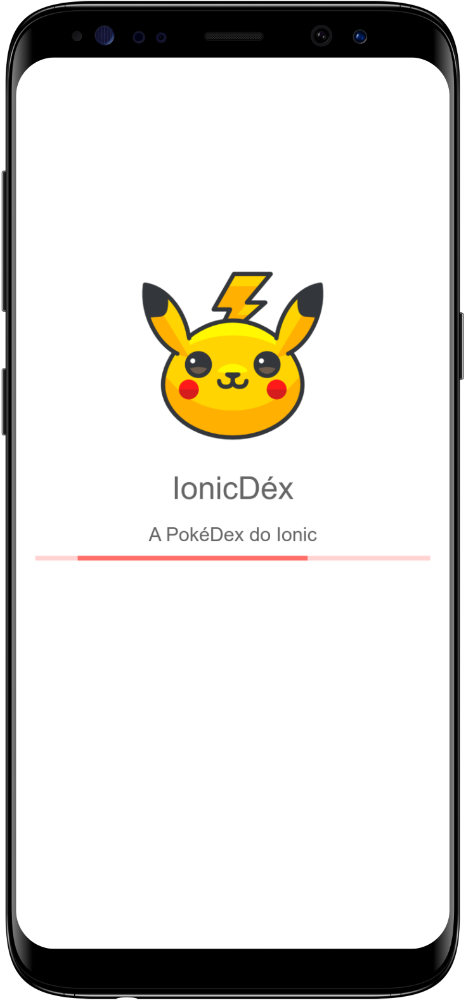
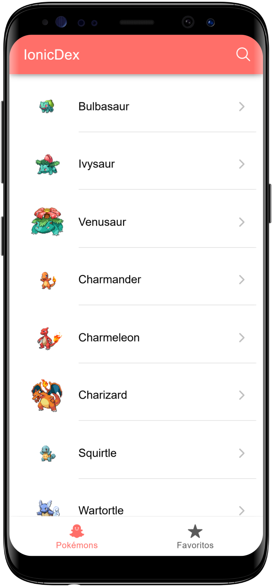
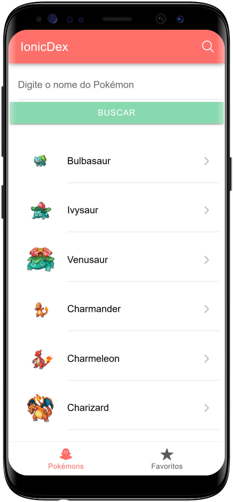
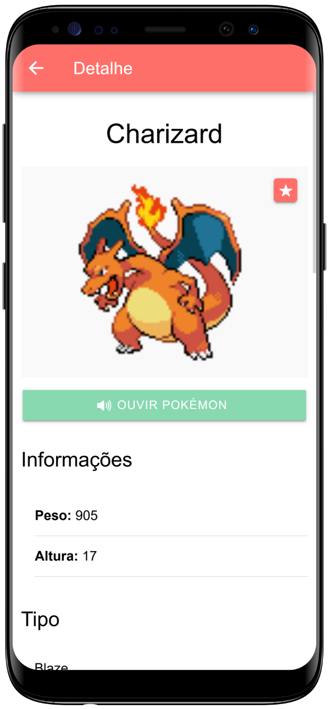
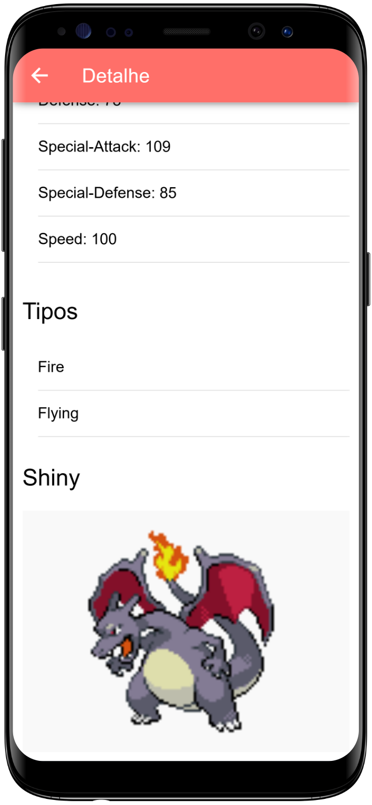

# IonicDéx

## A PokéDex do Ionic

### Funcionalidades

- **Lista de Pokémons:** Exibe todos os pokémons com informações relevantes.  
- **Infinite Scroll:** Carrega automaticamente mais pokémons conforme o usuário rola a tela.  
- **Pesquisa por Nome:** Permite que o usuário busque um Pokémon específico pelo nome.  
- **Detalhes do Pokémon:** Apresenta informações detalhadas sobre o Pokémon selecionado.  
- **Reprodução do Som:** Exibe e reproduz o som que cada Pokémon faz.  
- **Versão Shiny:** Permite visualizar a versão shiny de cada Pokémon.

### Tecnologias

- **Ionic Framework**
- **Capacitor**
- **Angular**
- **Typescript**

### Descrição

IonicDéx é uma aplicação desenvolvida com Ionic e Angular que funciona como uma PokéDex. Com um design responsivo, o app oferece a possibilidade de explorar pokémons, buscar pelo nome, visualizar detalhes, ouvir os sons característicos e conferir a versão shiny dos pokémons. Além disso, o infinite scroll garante uma experiência de navegação fluída e dinâmica.

### Screenshots

Confira abaixo alguns dos principais recursos do projeto:








### Instalação

1. **Clone o repositório:**

   ```bash
   git clone https://github.com/jordanwmp/projeto-pokeapi.git
   ```

2. **Instale as dependências:**

```bash
   npm install
```

3. **Inicie o aplicativo:**

```bash
  ionic serve
```