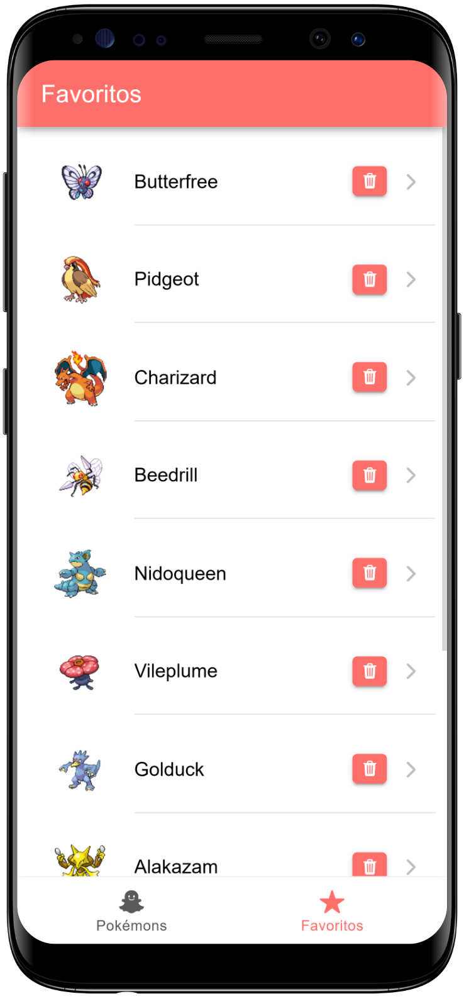

# IonicDéx

## A PokéDex do Ionic


### Funcionalidades

- **Lista de Pokémons:** Exibe todos os pokémons com informações relevantes.  
- **Infinite Scroll:** Carrega automaticamente mais pokémons conforme o usuário rola a tela.  
- **Pesquisa por Nome:** Permite que o usuário busque um Pokémon específico pelo nome.  
- **Detalhes do Pokémon:** Apresenta informações detalhadas sobre o Pokémon selecionado.  
- **Reprodução do Som:** Exibe e reproduz o som que cada Pokémon faz.  
- **Versão Shiny:** Permite visualizar a versão shiny de cada Pokémon.

### Tecnologias

- **Ionic Framework**
- **Capacitor**
- **Angular**
- **Typescript**

### Descrição

IonicDéx é uma aplicação desenvolvida com Ionic e Angular que funciona como uma PokéDex. Com um design responsivo, o app oferece a possibilidade de explorar pokémons, buscar pelo nome, visualizar detalhes, ouvir os sons característicos e conferir a versão shiny dos pokémons. Além disso, o infinite scroll garante uma experiência de navegação fluída e dinâmica.

### Abordagem

Eu arquitetei o projeto para trabalhar com os princípio de SOLID e divisão de responsabilidade. Criei services para serem utilizado em várias páginas, assim como componentes que também podem ser chamados em várias páginas. Como o projeto não é de alta complexidade, não utilizei nenhuma metodologia para o SASS,
com cada componente/página possuindo seus próprios estilos.

Além disso, busquei criar um design com boa experiência de usuário. Criei uma lista para apresentar os Pokémons, e um campo de pesquisa, caso ousuário deseje saber sobre um pokémon em específico. 

Também foi pensado a forma como as informações seriam apresentadas, já que cada pokémon possui muitos dados associados, e os mesmos devem ser apresentados de forma clara, para bom entendimento de quem os ler.

### Estilo de codificação

Eu gosto de trabalhar com o princípío da responsabilidade única, com cada classe, serviço e funções executando uma única tarefa. Então, eu realizo a inntegração entre eles criando o fluxo da aplicação. Tal abordagem melhora muito a eficiência de manutenbção e evolução do software. Eu prezo por manter o software o mais simples possível, subdividindo-o nas partes adequadas (componentes, provedores, services, páginas, etc.) 


### Design

O design do aplicativo foi pensado para ser clean, simples e elegante. Os pokémons apresentados em uma lista, com a imagem do pokémon e o nome do mesmo. Além disso, pensei em cores vivas para o tema, deixando a interface bem agradável. A lista deixa a usabilidade bem simples e intuitiva. 

A página de detalhes foi subdividida em seções, apresentando as informações de forma clara para o usuário.

O som do pokémon, fornecido pela API, também foi implementado para ser ouvido pelo usuário, fazendo com que o mesmo se sinta mais próximo do pokémon.

### Screenshots

Confira abaixo alguns dos principais recursos do projeto:





### Instalação

1. **Clone o repositório:**

```bash
   git clone https://github.com/jordan-will/ionic-pokedex.git
```

2. **Instale as dependências:**

```bash
   npm install
```

3. **Inicie o aplicativo:**

```bash
  ionic serve
```

### O ícone do aplicativo é uma cortesia da plataforma FlatIcon, e pode ser acessado no link abaixo.

```bash
  https://www.flaticon.com/free-icons/pokemon
```
